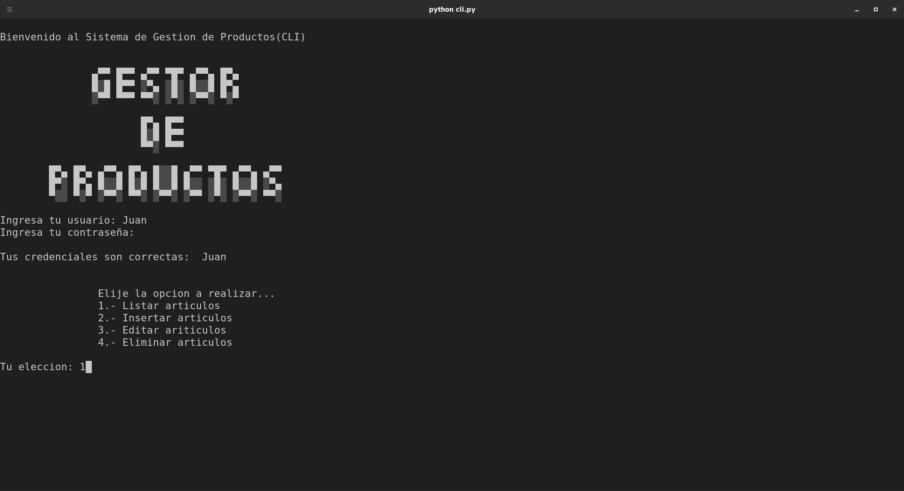
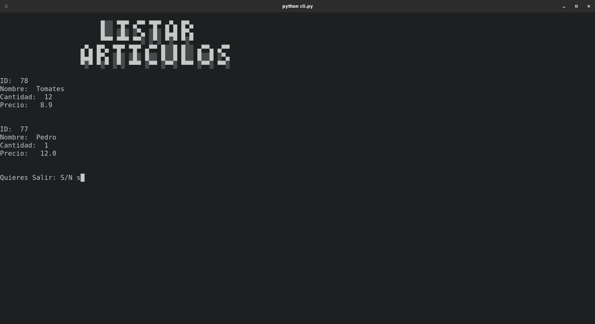
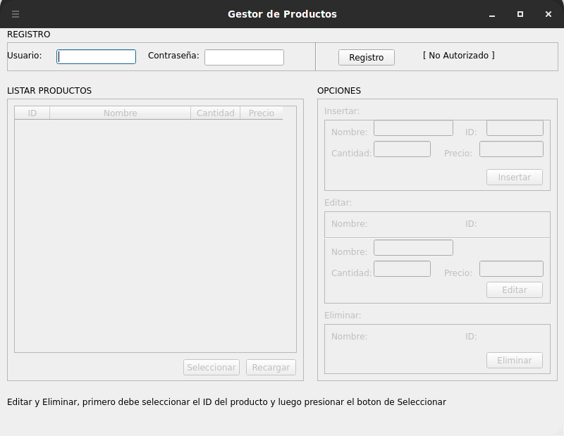
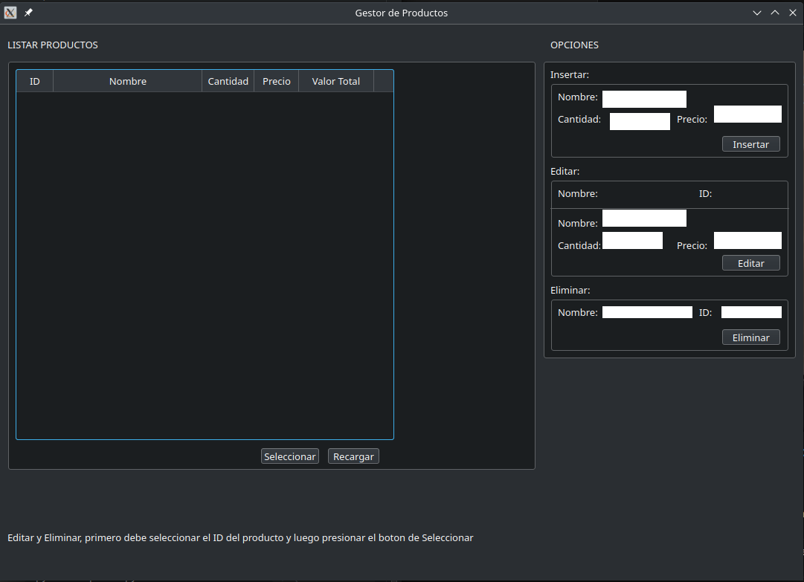

# Gestor de Productos 


 - [¿Que es?](#que-es)
	 - [Forma de Uso](#forma-de-uso)
 - [Instalación](#instalación)
	 - [Importante](#importante)
     - [Instalación de la Base de Datos](#instalación-de-mariadb-y-mysql)
     - [Docker](#docker)
	 - [Creación de la Base de Datos](#creación-de-la-base-de-datos)
	 - [Esquema de la Base de Datos](#esquema-de-la-base-de-datos)
	 - [Configuración de Python](#configuración-de-python)
 - [Errores](#errores)

# ¿Que es?
*/Actualmente esta es la versión 2.1, se han corregido la mayor parte de problemas para crear una base fuerte la cual permita añadir funcionalidades a futuro/*

Una herramienta destinada al manejo de productos y mercancía de forma sencilla y fácil, orientada a personas sin conocimientos en informática. Creada con el principal objetivo de poder utilizarse en casi cualquier dispositivo. 
Teniendo el software en tres presentaciones **CLI**,  **GUI**, **Web** y **APK**, con la finalidad de poder tener un control amplio de sus productos y mercancía.
## Forma de Uso
### CLI, GUI y APK (Aplicación Movil):
**Esta forma de uso esta disponible en caso de que se use desde el código fuente** 
Para usar el CLI debemos ejecutar el comando ` python3 cli.py ` o ejecutar `python3 splash.py` para la versión GUI. Posteriormente nos pedirá que ingresemos el usuario y contraseña esto se configuro en la INSTALACIÓN por defecto tenemos que esta es "Juan" y la contraseña es "Pilancho".
Teniendo la posibilidad de realizar las siguiente opciones.

 1. Listar Artículos
 2. Insertar Artículos
 3. Editar Artículos
 4. Eliminar Artículos

#### CLI (Screenshots)


#### GUI (Screenshots)
Para usar la Interfaz grafica, primero debe ingresar el usuario en el recuadro requerido, para luego acceder a la parte de administración, esto dependera si tu usuario es Administrador, solo si esto fuera cierto,accederia al menú correspondiente al Administrador.


### Web:
A diferencia de las anteriores  formas de uso, la aplicación web aun no se a completado pero se espera que pronto lo este, en comparacion con las otras versiones esta se ejecutara en el navegador y se conectara a una base de datos local para su uso.
### APK (Android):
Aplicación con la cual se pueda usar el gestor de productos desde el movil, por el momento va a estar disponible solo para android por lo cual esta seria una limitante, da servicio desde Android 5.0 en adelante, así que versiones inferiores serian incompatibles. 
# Instalación
Recuerde que debe tener de forma previa configurada una Base de Datos para almacenar lo mencionado. *Para esto leer el apartado de **"Creación de la Base de Datos"***
## Instalación y Uso en Windows y Linux
Para usar el software tenemos que hacer lo siguiente si tenemos git instalado pero en caso contrario, descargar el [codigo fuente](https://codeload.github.com/JorgeArguello1999/Gestor_Productos/zip/refs/heads/version.2).
```bash
git clone https://github.com/JorgeArguello1999/Gestor_Productos.git
cd Gestor_Productos
```
Modificar el archivo `db_connect.py` y usarlo inicando el .bat o el ejecutable para Linux. 
## Importante
Si desea desarrollar o ejecutar las ultimas versiones de *Gestor de Productos*, considere lo siguiente:

Tener instalado **Python3** y **pip3** (Instalador de paquetes de Python3), instalar el conector de Python a **MariaDB** con pip3 para la conexión `pip3 install mariadb` , se esta trabajando con un servidor local, base de datos aplicación, tabla productos y usuarios.
Para desarrollar la GUI necesitas instalar **PyQt5** usando el siguiente comando `pip install PyQt5` depende si lo hacen en Windows, Linux o Mac puede que requiera hacer pasos adicionales.
### Instalación de todo lo necesario para el desarrollo de la aplicación.
Para desarrollar la aplicación usted necesitara disponer de las siguientes aplicaciones en su computador u ordenador:
 - **Base de Datos**
     - **MariaDB** 
     - **MySQL** 
     - **SQLite** (Opcional solo para android en caso de no existir un servidor principal)
 - **Conectores y QtDesigner**
     - **mariadb** (Conector de MariaDB con Python)
     - **PyInstaller** (Crear ejecutables de la apliación)
     - **PyQt5** (Conjunto de librearias Qt para desarrollo)
     - **PyQt5-tools** (Herramienta gráfica para desarrollo del entorno gráfico Qt)
     - **pymysql** (Conector de MySQL con Python)

## Instalación de MariaDB y MySQL
Instalación y configuración de base de datos MariaDB
```bash
# Debian
sudo apt update
sudo apt install mariadb-server -y
sudo mysql_secure_installation
```

```bash
# Arch
sudo systemctl stop mysqld 
sudo pacman -Syu
yay -S python-mariadb-connector
sudo pacmna -S mariadb libmariadbclient mariadb-clients
sudo mysql_secure_install_db --user=root --basedir=/usr --datadir=/var/lib/mysql

sudo systemctl start mariadb
sudo mysql_secure_installation
systemctl restart mariadb
```

```
NOTE: RUNNING ALL PARTS OF THIS SCRIPT IS RECOMMENDED FOR ALL MariaDB
 SERVERS IN PRODUCTION USE! PLEASE READ EACH STEP CAREFULLY!

 In order to log into MariaDB to secure it, we'll need the current
 password for the root user. If you've just installed MariaDB, and
 you haven't set the root password yet, the password will be blank,
 so you should just press enter here.

 Enter current password for root (enter for none):
 OK, successfully used password, moving on...

 Setting the root password ensures that nobody can log into the MariaDB
 root user without the proper authorisation.

 Set root password? [Y/n] y
 New password:
 Re-enter new password:
 Password updated successfully!
 Reloading privilege tables..... Success!


 By default, a MariaDB installation has an anonymous user, allowing anyone
 to log into MariaDB without having to have a user account created for
 them. This is intended only for testing, and to make the installation
 go a bit smoother. You should remove them before moving into a
 production environment.

 Remove anonymous users? [Y/n] y... Success!

 Normally, root should only be allowed to connect from 'localhost'. This
 ensures that someone cannot guess at the root password from the network.

 Disallow root login remotely? [Y/n] n... skipping.

 By default, MariaDB comes with a database named 'test' that anyone can
 access. This is also intended only for testing, and should be removed
 before moving into a production environment.

 Remove test database and access to it? [Y/n] y
 - Dropping test database...... Success!
 - Removing privileges on test database...... Success!

 Reloading the privilege tables will ensure that all changes made so far
 will take effect immediately.

 Reload privilege tables now? [Y/n] y... Success!

 Cleaning up...

 All done! If you've completed all of the above steps, your MariaDB
 installation should now be secure.

 Thanks for using MariaDB!
```

Instalación de conectores mediante PIP (Gestor de paquetes de Python)
```bash
pip install mariadb pymysql pyqt5 pyqt5-tools
```

Crear ejecutable (Dependiendo el Sistema Operativo compilara un .EXE o un .DMG)
```
pyinstaller --clean --onefile --windowed archivo.py #CLI o GUI
```

## Docker
El uso de docker es el plan original, usarlo con una instancia, con un volumen permanente para tener una base de datos portable y que el programa pueda ser escalable a futuro

```bash
# Debian
sudo apt install docker

# Arch 
sudo pacman -Sy docker

# Windows 
Para el caso de Windows descargarlo desde su pagina oficial
```
Para usar docker realizar los siguientes comandos:

/*Esto se encuentra provisional hasta crear una imagen propia para la aplicación*/ 

```bash
#!/bin/bash

# ->>> IMPORTANTE CAMBIA LA UBICACION DEL VOLUMEN, COLOCA LA UBICACIÓN DE LA CARPETA 
# ->>> "~/Escritorio/Gestor_Productos/docker_DB" lo cambias a tu ruta por ejemplo: "C:\\Users\UsuarioWindows\Escritorio\Gestor_Productos\docker_DB"

# MariaDB
docker run -v ~/Escritorio/Gestor_Productos/docker_DB:/var/lib/mysql -p 3306:3306 --name gestor_productos --env MARIADB_USER=jorge --env MARIADB_PASSWORD=basededatos -d --env MARIADB_ROOT_PASSWORD=root mariadb

# EXEC
docker exec -it gestor_productos mysql -u jorge -p
Enter password: basededatos

# MySQL
docker run -v ~/personal/Gestor_Productos/docker_DB:/var/lib/mysql -e MYSQL_ROOT_PASSWORD=root -p 3306:3306 --name gestor_productos -d mysql

# EXEC
docker exec -it gestor_productos mysql -u root -p

```

## Creación de la Base de datos 
Para crear la Base de datos necesitaremos MariaDB o en su defecto MySQL 4.04 en adelante. Esto se recomienda ya que se usa el cifrado AES que esta disponible desde la versión 4.04 en adelante en el gestor de Base de Datos MySQL y MariaDB, ingrese los siguientes comandos dentro de la consola de MySQL o MariaDB

### Creación de la Base de Datos
```sql
CREATE DATABASE aplicacion;
USE aplicacion;
```
### Creación de usuario
Hasta el momento hemos trabajado con el usuario *root* lo cual supone ciertos peligros y limitantes a la hora de trabajar con varias personas.
```sql
GRANT USAGE ON *.* TO 'usuario'@'%' IDENTIFIED BY 'contraseña';
```
Lo que hacemos es crear un usuario el cual va a tener acceso a la base de datos y de esta manera no usar el *root*.
```sql
GRANT ALL privileges ON `aplicacion`.* TO 'usuario'@'%';
```
Para terminar de guardar los cambios solo ejecutamos la siguiente linea:
```sql
FLUSH PRIVILEGES;
```
Ahora ya podemos iniciar MariaDB o MySQL con su nuevo usuario con el comando `mysql -u usuario -p contraseña`
### Creación de la Tabla para los usuarios
```sql
CREATE TABLE usuarios( 
    id_usuario INTEGER NOT NULL PRIMARY KEY AUTO_INCREMENT, 
    usuario VARCHAR(20) NOT NULL, 
    clave VARCHAR(50) NOT NULL, 
    area VARCHAR(50) NOT NULL ) /*valores: admin, cajero, bodega*/
    ENGINE= 'InnoDB' DEFAULT CHAR SET= latin1;
```
En la sección de Area, la unica anotación importante es que el usuario que tendra el Control y la gestión de usuarios es el usuario 'admin'

### Creación de la Tabla para los productos
```sql
CREATE TABLE productos( 
    id INTEGER(11) NOT NULL PRIMARY KEY AUTO_INCREMENT,
    nombre VARCHAR(30), 
    cantidad INTEGER(11), 
    precio FLOAT);
```
## Esquema de la Base de Datos
Base de datos= "aplicacion"
Tablas:

 - **productos**
     - **id** (INT 11 NOT NULL PRIMARY KEY AUTOINCREMENT)
     -  **nombre** (VARCHAR 30)
     - **cantidad** (INT 11)
     - **precio** (FLOAT)
  - **usuarios**
       - **id_usuario** (INT NOT NULL PRIMARY KEY AUTOINCREMENT)
       - **usuario** (VARCHAR 20 NOT NULL) 
       - **clave** (VARCHAR 50 NOT NULL)
       - **area** (VARCHAR 50 NOT NULL) *Acepta valores "admin, cajero, bodega"*

Como debería verse las tablas creadas:
```
MariaDB [aplicacion]> DESCRIBE productos;
+----------+-------------+------+-----+---------+----------------+
| Field    | Type        | Null | Key | Default | Extra          |
+----------+-------------+------+-----+---------+----------------+
| id       | int         | NO   | PRI | NULL    | auto_increment |
| nombre   | varchar(30) | YES  |     | NULL    |                |
| cantidad | int         | YES  |     | NULL    |                |
| precio   | float       | YES  |     | NULL    |                |
+----------+-------------+------+-----+---------+----------------+


MariaDB [aplicacion]> DESCRIBE usuarios;
+------------+-------------+------+-----+---------+----------------+
| Field      | Type        | Null | Key | Default | Extra          |
+------------+-------------+------+-----+---------+----------------+
| id_usuario | int         | NO   | PRI | NULL    | auto_increment |
| usuario    | varchar(20) | NO   |     | NULL    |                |
| clave      | varchar(50) | NO   |     | NULL    |                |
| area       | varchar(50) | NO   |     | NULL    |                |
+------------+-------------+------+-----+---------+----------------+

```
## Configuración de Python
Para configurar la conexión con base de datos debemos configurar el archivo `db_connect.py`, este archivo contiene la configuración para la base de datos, el usuario y las credenciales para acceder a la misma

```python
    import mariadb as database # Este es el modulo de conexión (MariaDB)
    import pymysql as database # Modulo en caso de ser MySQL
    
    class Conexion:
        # Verificacion de usuario
        def __init__(self):
            self.conn = mariadb.connect(
                user="jorge", # Aqui colocamos el usuario para la base de datos
                password="basededatos", # Contraseña para la misma
                host="192.168.1.8", # El lugar de la base de datos localhost=127.0.0.1 o alguna otra.
                database="aplicacion" # Nombre de la base de Datos a usar.
                )
```
# Errores

## Error (101)
El error 101 en el área de Insertar hace referencia a que en la base de datos ya existe un elemento con el mismo ID, si se quiere registrar un elemento del mismo nombre, se recomienda usar otro ID para evitar este problema
## Error (102)
El error 102 es aquel que aparece cuando se intenta eliminar un producto que no existe en la base de datos.

## Error (103)
El error 103 es aquel que ocurre cuando un elemento a actualizar no existe en la tabla de la base de datos, para solucionarlo debes crear el elemento.

## Error (104)
Este error es producido por la GUI o Interfaz gráfica, este se provoca al ocurrir un error en la inserción de datos en la tabla, debe respetar el tipo de datos que aceptan cada uno Nombre(Texto), ID(Numero Entero), Cantidad (Numero Entero), Precio(Numero Flotante o Decimal).
